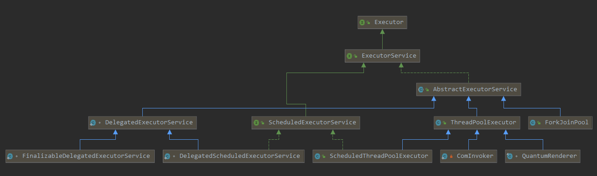
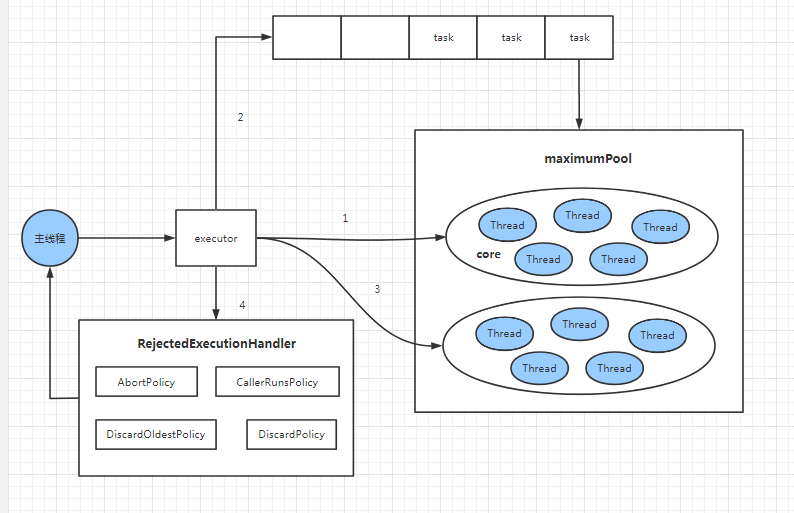

## 线程池的状态

- RUNNING：能够接收新任务，以及对新加的任务进行任务，创建线程池的默认状态。
- SHUTDOWN：不在接收新任务，会继续处理完正在处理的任务和阻塞队列中的任务，调用`shutdown()`更改状态。
- STOP：不在接收新任务，不在处理阻塞队列中的任务，并中断线程池中正在处理的任务，调用`shutdownNow()`更改状态。
- TINY： SHUTDOWN状态时，所有任务已中止，阻塞队列中的任务数量为0；STOP状态时，所有任务已中止
- TERMINATED：线程池彻底终止。

### 线程池的重要属性&方法

```java
private final AtomicInteger ctl = new AtomicInteger(ctlOf(RUNNING, 0));
private static final int COUNT_BITS = Integer.SIZE - 3;
private static final int CAPACITY   = (1 << COUNT_BITS) - 1;
private static int runStateOf(int c)     { return c & ~CAPACITY; }
private static int workerCountOf(int c)  { return c & CAPACITY; }
private static int ctlOf(int rs, int wc) { return rs | wc; }
```

- `ctl`：高三位记录线程池的状态，低29位保存线程池的线程数量
- `COUNT_BITS`：低29位
- `CAPACITY`：线程池的线程容量，`2^29-1`
- `runStateOf`：获取运行状态
- `workerCountOf`：获取活动线程的数量
- `ctlOf`：得出运行状态和活动线程的值，新的`ctl`


## 线程池的具体实现



- `ThreadPoolExecutor`：默认线程池
- `ScheduledThreadPoolExecutor`：定时任务线程池

## 线程池的创建

```java
public ThreadPoolExecutor(int corePoolSize,
                          int maximumPoolSize,
                          long keepAliveTime,
                          TimeUnit unit,
                          BlockingQueue<Runnable> workQueue,
                          ThreadFactory threadFactory,
                          RejectedExecutionHandler handler)
```

- `corePoolSize`：核心线程数，当提交一个任务时，线程池会创建一个新线程处理任务，直到线程数量等于`corePoolSize`，后续再提交线程时会将线程放入阻塞队列。

- `maximumPoolSize`：最大线程数，当阻塞队列已满，此时再提交任务时，会创建非核心线程进行处理，线程池中创建的线程数量必须小于`maximumPoolSize`

- `keepAliveTime`：线程空闲时间，当线程池中的线程数量大于`corePoolSize`（存在非核心线程），如果此时没有新的任务提交，非核心线程不会立即销毁，而是会等待，直到等待时间超过了`keepAliveTime`

- `unit`：线程空闲的时间单位

- `workQueue`：用来保存等待被执行的任务的阻塞队列，JDK中提供了以下阻塞队列

  - `ArrayBlockingQueue`：基于数组结构的有界阻塞队列，按FIFO排序任务
  - `LinkedBlockingQuene`：基于链表结构的有界阻塞队列，按FIFO排序任务，吞吐量通常要高于`ArrayBlockingQuene`；
  - `SynchronousQuene`：一个不存储元素的阻塞队列，每个插入操作必须等到另一个线程调用移除操作，否则插入操作一直处于阻塞状态，吞吐量通常要高于`LinkedBlockingQuene`；
  - `PriorityBlockingQueue`：具有优先级的无界阻塞队列

- `threadFactory`：用于创建新线程

- `handler`：饱和策略，当阻塞队列满了，且没有空闲的工作线程，如果继续提交任务，必须采取一种策略处理该任务，线程池提供了4种策略：

  - `AbortPolicy`：直接抛出异常，默认策略
  - `CallerRunsPolicy`：用调用者所在的线程来执行任务
  - `DiscardOldestPolicy`：丢弃阻塞队列中靠最前的任务，并执行当前任务
  - `DiscardPolicy`：直接丢弃任务

  >  当然也可以根据应用场景实现`RejectedExecutionHandler`接口，自定义饱和策略，如记录日志或持久化存储不能处理的任务。

## 线程池核心原理



### execute方法注释

```java
public void execute(Runnable command) {
        int c = ctl.get();
        if (workerCountOf(c) < corePoolSize) {//线程池里面的线程数量小于核心线程
            if (addWorker(command, true))
                //addWorker方法会开启一个新线程，如果线程池已停或者线程数量已满，返回false
                return;
            c = ctl.get();
        }
        //走到这里这里表示要么线程池停止了，要么核心线程满了
        if (isRunning(c) && workQueue.offer(command)) {
            //这里表示加入到阻塞队列里
            int recheck = ctl.get();
            if (! isRunning(recheck) && remove(command))
                reject(command);
            else if (workerCountOf(recheck) == 0)//如果线程池里面没有线程，有线程就不管，让原有线程处理阻塞队列的任务
                addWorker(null, false);//创建一个非核心线程
        }
        //这里表示线程池停了或阻塞队列满了，创建一个非核心线程处理新任务
        else if (!addWorker(command, false))
            //线程池停了，或者线程池的最大线程数量已经满了
            reject(command);
    }
```

