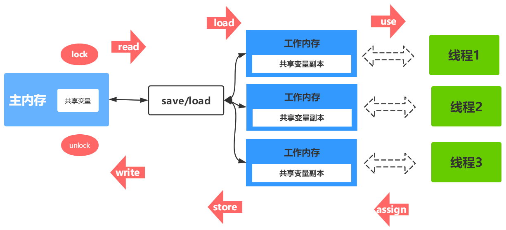

## 什么是线程

进程是系统分配资源的基本单位，线程是CPU调度的基本单位，每个进程至少有一个线程，线程寄生在进程当中，每个线程都有一个程序计数器（保存下个要执行的指令），一组寄存器（保存当前线程中的工作变量），堆栈（记录执行历史，每一帧中保存了一个已调用但未返回的方法）。

线程分两类：

- 用户级线程（user level thread)
- 内核级线程（kernel level thread)

用户空间划分：

- 用户空间
- 内核空间

## `ULT`与`KLT`

## Java线程与内核线程的关系

##  Java线程生命状态 

## 线程上下文切换过程

## `JMM`模型

`JMM`与`JVM`内存区域的划分是不同的概念层次，更恰当说`JMM`描述的是一组规则，通过这组规则控制程序中各个变量在共享数据区域和私有数据区域的访问方式，**`JMM`是围绕原子性，有序性、可见性展开**。

## Java内存模型内存交互操作

- **lock(锁定)：**作用于主内存的变量，把一个变量标记为一条线程独占状态
- **read(读取)：**作用于主内存的变量，把一个变量值从主内存传输到线程的工作内存中，以便随后的load动作使用
- **load(载入)：**作用于工作内存的变量，它把read操作从主内存中得到的变量值放入工作内存的变量副本中
- **use(使用)：**作用于工作内存的变量，把工作内存中的一个变量值传递给执行引擎
- **assign(赋值)：**作用于工作内存的变量，它把一个从执行引擎接收到的值赋给工作内存的变量
- **store(存储)：**作用于工作内存的变量，把工作内存中的一个变量的值传送到主内存中，以便随后的write的操作
- **write(写入)：**作用于工作内存的变量，它把store操作从工作内存中的一个变量的值传送到主内存的变量中
- **unlock(解锁)：**作用于主内存的变量，把一个处于锁定状态的变量释放出来，释放后的变量才可以被其他线程锁定

> 把一个变量从主内存中复制到工作内存中，就需要按顺序地执行read和load操作，如果把变量从工作内存中同步到主内存中，就需要按顺序地执行store和write操作。但Java内存模型只要求上述8大操作(原子操作)必须按顺序执行，而没有保证必须是连续执行。

1. 不允许一个线程无原因地（没有发生过任何assign操作）把数据从工作内存同步回主内存中
2. 一个新的变量只能在主内存中诞生，不允许在工作内存中直接使用一个未被初始化（load或者assign）的变量。即就是对一个变量实施use和store操作之前，必须先自行assign和load操作。
3. 一个变量在同一时刻只允许一条线程对其进行lock操作，但lock操作可以被同一线程重复执行多次，多次执行lock后，只有执行相同次数的unlock操作，变量才会被解锁。lock和unlock必须成对出现。
4. 如果对一个变量执行lock操作，将会清空工作内存中此变量的值，在执行引擎使用这个变量之前需要重新执行load或assign操作初始化变量的值。
5. 如果一个变量事先没有被lock操作锁定，则不允许对它执行unlock操作；也不允许去unlock一个被其他线程锁定的变量。
6. 对一个变量执行unlock操作之前，必须先把此变量同步到主内存中（执行store和write操作）

