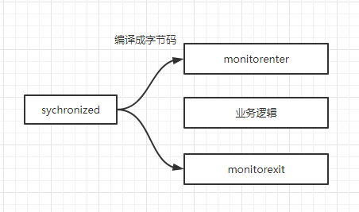
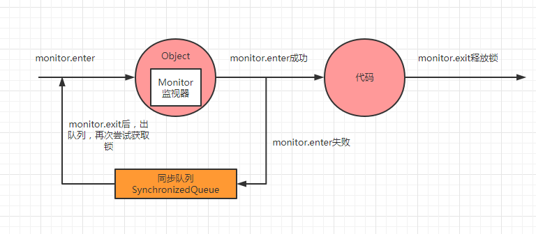
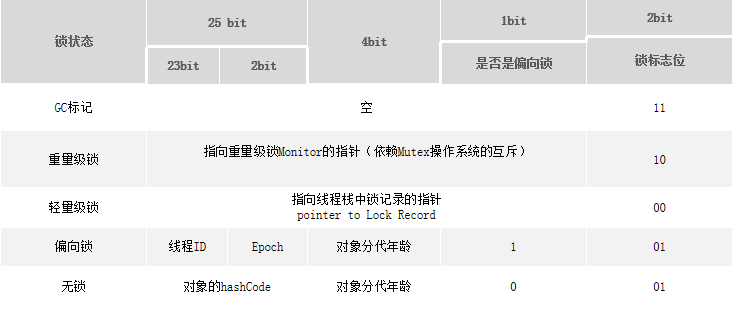
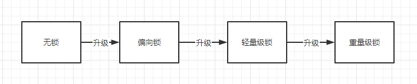

并发安全问题

多线程编程中，有可能会出现多个线程同时访问同一个共享、可变资源的情况，这个资源我们称之其为临界资源；这种资源可能是：对象、变量、文件等。 

- 共享：资源可以由多个线程同时访问 

- 可变：资源可以在其生命周期内被修改

由于线程执行的过程是不可控的，所以需要采用同步机制来协同对对象可变状态的访问，实际上，所有的并发模式在解决线程安全问题时，采用的方案都是**序列化**访问临界资源。即在同一时刻，只能有一个线程访问临界资源也称作**同步互斥访问**。

> Java中提供了两种实现同步互斥访问的方式：`synchronized`和`Lock`

## `synchronized`原理详解

synchronized内置锁是一种可重入的对象锁

加锁方式：

- 非静态方法加锁，锁的是当前实例对象
- 同步代码块加锁，锁的是括号内的对象（可以是实列对象，或者类对象）
- 静态方法加锁，锁的是该方法的类对象

### 底层原理

synchronized是基于`JVM`内置锁实现，通过内部对象Monitor(监视器锁)实现，基于进入与退出Monitor对象实现方法与代码块同步，监视器锁的实现依赖底层操作系统的`Mutex lock（互斥锁）`实现，它是一个重量级锁性能较低。当然，`JVM`内置锁在1.5之后版本做了重大的优化，如**锁粗化（Lock Coarsening）、锁消除（Lock Elimination）、轻量级锁（Lightweight Locking）、偏向锁（Biased Locking）、适应性自旋（Adaptive Spinning）**等技术来减少锁操作的开销，内置锁的并发性能已经基本与Lock持平。 

synchronized关键字被编译成字节码后会被翻译成`monitorenter`和`monitorexit` 两条指令分别在同步块逻辑代码的起始位置与结束位置。



每个同步对象都有一个自己的Monitor(监视器锁)，加锁过程如下图所示：



对象头的Mark Word



### 锁的膨胀升级过程

锁的状态总共有四种：无锁状态、偏向锁、轻量级锁、重量级锁

锁的升级过程：



> 锁的升级过程是不可逆的

锁的升级全过程：


### 偏向锁 

偏向锁是Java 6之后加入的新锁，它是一种针对加锁操作的优化手段，经过 研究发现，在大多数情况下，锁不仅不存在多线程竞争，而且总是由同一线程多次获得，因此为了减少同一线程获取锁(会涉及到一些CAS操作,耗时)的代价而引入偏向锁。偏向锁的核心思想是，如果一个线程获得了锁，那么锁就进入偏向模式，此时Mark Word 的结构也变为偏向锁结构，当这个线程再次请求锁时，无需再做任何同步操作，即获取锁的过程，这样就省去了大量有关锁申请的操作，从而也就提供程序的性能。所以，对于没有锁竞争的场合，偏向锁有很好的优化效果，毕竟极有可能连续多次是同一个线程申请相同的锁。但是对于锁竞争比较激烈的场合，偏向锁就失效了，因为这样场合极有可能每次申请锁的线程都是不相同的，因此这种场合下不应该使用偏向锁，否则会得不偿失，需要注意的是，偏向锁失败后，并不会立即膨胀为重量级锁，而是先升级为轻量级锁。下面我们接着了解轻量级锁。 

### 轻量级锁
倘若偏向锁失败，虚拟机并不会立即升级为重量级锁，它还会尝试使用一种称为轻量级锁的优化手段(1.6之后加入的)，此时Mark Word 的结构也变为轻量级锁的结构。轻量级锁能够提升程序性能的依据是“对绝大部分的锁，在整个同步周期内都不存在竞争”，注意这是经验数据。需要了解的是，轻量级锁所适应的场景是线程交替执行同步块的场合，如果存在同一时间访问同一锁的场合，就 会导致轻量级锁膨胀为重量级锁。

### 自旋锁
轻量级锁失败后，虚拟机为了避免线程真实地在操作系统层面挂起，还会进 行一项称为自旋锁的优化手段。这是基于在大多数情况下，线程持有锁的时间都 不会太长，如果直接挂起操作系统层面的线程可能会得不偿失，毕竟操作系统实 现线程之间的切换时需要从用户态转换到核心态，这个状态之间的转换需要相对 比较长的时间，时间成本相对较高，因此自旋锁会假设在不久将来，当前的线程 可以获得锁，因此虚拟机会让当前想要获取锁的线程做几个空循环(这也是称为 自旋的原因)，一般不会太久，可能是50个循环或100循环，在经过若干次循环 后，如果得到锁，就顺利进入临界区。如果还不能获得锁，那就会将线程在操作 系统层面挂起，这就是自旋锁的优化方式，这种方式确实也是可以提升效率的。 最后没办法也就只能升级为重量级锁了。

### 重量级锁
基于进入与退出Monitor对象实现方法与代码块同步，监视器锁的实现依赖底层操作系统的`Mutex lock（互斥锁）`实现，会阻塞线程，涉及系统调用、用户态和内核态切换的开销。

### 锁粗化
把很多次锁的请求合并成一个请求，以降低短时间内大量锁请求、同步、释放带来的性能损耗。这里我个人觉得这更是一种开发者层面的锁优化方式。
```java
 public void coarsen(){
        synchronized (object){

        }
        //少量的业务代码
        synchronized (object){

        }
    }
```

> 由于两个synchronized之间只有少量的业务代码，可以将他们合并成一个synchronized，但如果中间是大量的业务代码，那就得不偿失了。

### 锁消除

消除锁是虚拟机另外一种锁的优化，这种优化更彻底，Java虚拟机在`JIT`编 译时(可以简单理解为当某段代码即将第一次被执行时进行编译，又称即时编 译)，通过对运行上下文的扫描，去除不可能存在共享资源竞争的锁，通过这种 方式消除没有必要的锁，可以节省毫无意义的请求锁时间，如下`StringBuffer`的`append`是一个同步方法，但是在`remove`方法中的`StringBuffer`属于一个局部变量， 并且不会被其他线程所使用，因此`StringBuffer`不可能存在共享资源竞争的情景，`JVM`会自动将其锁消除。

```json
public void remove(){
        StringBuffer sb = new StringBuffer();
        sb.append(1);
        sb.append(2);
        sb.append(3);
    }
```

