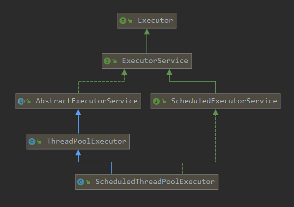
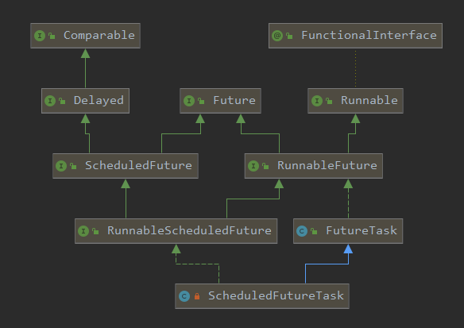

## `ScheduledThreadPoolExecutor`使用

```java
int initialDelay = 5;
        System.out.println(Thread.currentThread().getName() + " " + TimeUnit.MILLISECONDS.toSeconds(System.currentTimeMillis()));
        ScheduledExecutorService executorService = Executors.newScheduledThreadPool(1);
        //以上一个任务开始的时间计时，period时间过去后，检测上一个任务是否执行完毕，如果上一个任务执行完毕，则当前任务立即执行，如果上一个任务没有执行完毕，则需要等上一个任务执行完毕后立即执行。
        executorService.scheduleAtFixedRate(()->{
            System.out.println(Thread.currentThread().getName() + " " + TimeUnit.MILLISECONDS.toSeconds(System.currentTimeMillis()));
            try {
                TimeUnit.SECONDS.sleep(3);
            } catch (InterruptedException e) {
                e.printStackTrace();
            }
        },initialDelay,5, TimeUnit.SECONDS);

        //以上一个任务结束时开始计时，period时间过去后，立即执行
        executorService.scheduleWithFixedDelay(()->{
            System.out.println(TimeUnit.MILLISECONDS.toSeconds(System.currentTimeMillis()));
            try {
                TimeUnit.SECONDS.sleep(3);
            } catch (InterruptedException e) {
                e.printStackTrace();
            }
        },initialDelay,5, TimeUnit.SECONDS);
```

## `ScheduledThreadPoolExecutor`原理

`ScheduledThreadPoolExecutor` 底层实现为`ThreadPoolExecutor` 和自定义 `DelayWorkQueue`延时队列结合使用，`ThreadPoolExecutor` 原理已在前面**线程池原理与源码剖析**中有详细说明，延时队列原理在**Queue**阻塞队列中详细说明。

大概原理：将任务封装到一个既实现`Runnable`接口又继承`Delayed`类的`ScheduledFutureTask`类中，放入延时队列中，再调用我们的`ThreadPoolExecutor` 中的`executor`方法开启线程，调用`ScheduledFutureTask`中的`run`方法，该方法再调用真正任务的`run`方法，处理完真正任务的`run`方法后，计算下次任务的执行时间，再次将`ScheduledFutureTask`放入延时队列，回到调用我们的`ThreadPoolExecutor` 中的`executor`方法的逻辑，继续往下执行。



